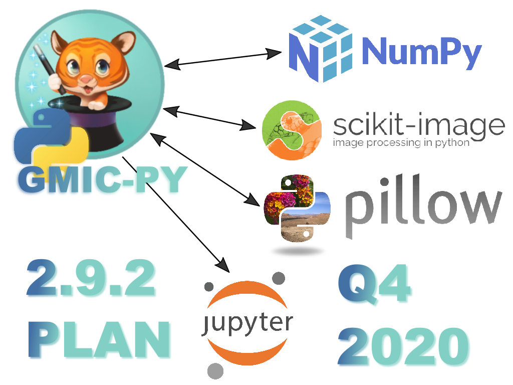
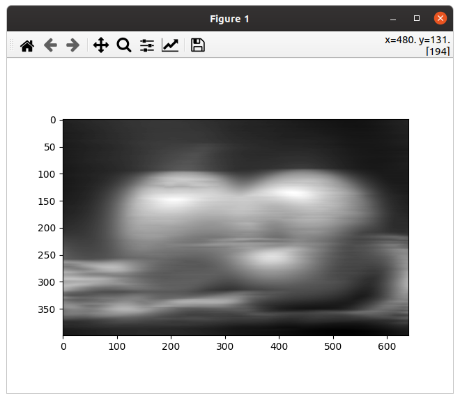
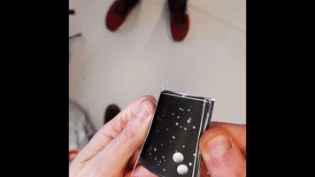
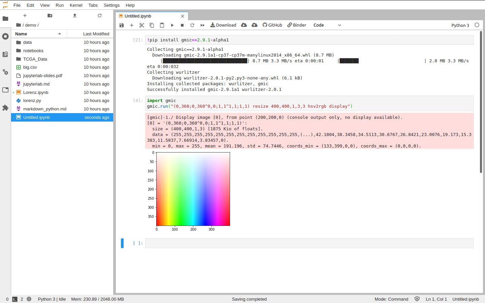

[](https://gmic.eu)
[](https://www.python.org)

#### 
#### Python binding for G'MIC - A Full-Featured Open-Source Framework for Image Processing
##### https://gmic.eu

---------------------------

# gmic-py
[](https://pypi.python.org/pypi/gmic/)
[](https://pypi.python.org/pypi/gmic/)
[](https://pypi.python.org/pypi/gmic/)
[](https://pypi.python.org/pypi/gmic/)
[](https://pypi.python.org/pypi/gmic/)
[](https://pypi.python.org/pypi/gmic/)
[](https://pypi.python.org/pypi/gmic/)


/badge.svg)

/badge.svg)


`gmic-py` is the official Python 3 binding for the [G'MIC C++ image processing library](https://gmic.eu) purely written with Python's C API.
Its Python package name on [pypi.org](https://pypi.org/project/gmic/) is just `gmic`.
This project lives under the CeCILL license (similar to GNU Public License).


You can use the `gmic` Python module for projects related to desktop or server-side graphics software, numpy, video-games, image procesing.

Check out the [`gmic-py` documentation website (readthedocs)](https://gmic-py.readthedocs.io/) for Quickstart, Tutorials, API Reference and `gmic-py` third-party integrations.

`gmic-py`'s slowly growing community gravitates around:

- this [Github's project Issue tracker](https://github.com/myselfhimself/gmic-py/issues),
- [Twitter (#gmicpy)](https://twitter.com/search?q=%23gmicpy&src=typed_query)
- [the pixls.us `gmic-py` forum thread](https://discuss.pixls.us/t/developing-and-fiddling-with-the-gmic-python-binding/20406).



[gmic-blender](https://github.com/myselfhimself/gmic-blender) is a Blender3d add-on bundling `gmic-py` and allowing you use a new `gmic` module from there without installing anything more.

## Quickstart
First install the G'MIC Python module in your (virtual) environment.

```sh
pip install gmic
```

G'MIC is a language processing framework, interpreter and image-processing scripting language. 
Here is how to load `gmic`, and evaluate some G'MIC commands with an interpreter.
```python
import gmic
gmic.run("sp earth blur 4") # On Linux a window shall open-up with a blurred earth
gmic.run("sp rose fx_bokeh 3,8,0,30,8,4,0.3,0.2,210,210,80,160,0.7,30,20,20,1,2,170,130,20,110,0.15,0 output rose_with_bokeh.png") # Save a rose with bokeh effect to file
```

A [full-featured `gmic-py` Quickstart tutorial](https://gmic-py.readthedocs.io/en/latest/gettingstarted.html) is available here.
Tutorials on various topics are available in the [documentation](https://gmic-py.readthedocs.io/en/latest/tutorials.html).

## Documentation
Full documentation is being written at [https://gmic-py.readthedocs.io/](https://gmic-py.readthedocs.io/).

## Supported platforms
`gmic-py` works for Linux and Mac OS x 64bits architecture x Python >= 3.6. Windows support is planned for Q4 2020.

In case your environment is a type of Unix, but compiling from source is needed, note that the `pip` installer will download `gmic-py`'s source and most possibly compile it very well.
See the `CONTRIBUTING.md` file and the [documentation](https://gmic-py.readthedocs.io/) for tips on building `gmic-py` for your own OS.

## Examples
All examples belong [in the examples/ folder](examples/).

Some of them correspond to [tutorials on `gmic-py`'s readthedocs website](https://gmic-py.readthedocs.io/en/latest/tutorials.html).

### Applying a simple filter

```python
import gmic
gmic.run("sample apples rodilius 10 display") # more at https://gmic.eu/reference/rodilius.html
```

[Example from tutorial 1](https://gmic-py.readthedocs.io/en/latest/tutorials.html#applying-a-one-or-more-filter-s)


### Numpy integration
`gmic-py` supports `GmicImage` input/output with `numpy`, `scikit-image` and `Pillow` (`PIL`) if any of those are installed.

[Example from the Quickstart tutorial](https://gmic-py.readthedocs.io/en/latest/gettingstarted.html#working-with-the-numpy-support)

```python
import numpy
from matplotlib import pyplot as plt
import gmic

images = []
gmic.run("sp apples blur_x 30 fx_freaky_bw 90,20,0,0,0,0", images) # horizontal blur+special black&white
numpy_im = images[0].to_numpy_helper(interleave=True,permute="yxzc", squeeze_shape=True, astype=numpy.uint8)
plt.imshow(numpy_im, plt.get_cmap('gray'))
plt.show()
```



### Creating a flipbook from a GIF file
Filtering GIF images, ontage'd into an A4 sheet paper.

[Example from tutorial 3](https://gmic-py.readthedocs.io/en/latest/tutorials.html#tutorial-3-filtering-gif-and-videos)



### Jupyter / Google Colab / IPython integration
`gmic-py` provides G'MIC console output retrieval and images `display` emulation for IPython/Jupyter/Google Colab environments:



Details on the [related Jupyter/IPython/* support documentation page](https://gmic-py.readthedocs.io/en/latest/jupyter.html).

### Using your camera with G'MIC's optional OpenCV linking (advanced)
If your machine has `libopencv` installed and you [build `gmic-py` from source](https://gmic-py.readthedocs.io/en/latest/compiling.html#tl-dr-building-gmic-py-on-linux) (ie. `python setup.py build`), G'MIC OpenCV commands will be enabled.

[Example G'MIC OpenCV script](examples/opencv-camera/gmic-py-opencv-camera.py)

