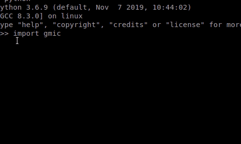

<a href="https://gmic.eu"></a>
<a href="https://www.python.org"></a>

#### 
#### Python binding for G'MIC - A Full-Featured Open-Source Framework for Image Processing
##### https://gmic.eu

---------------------------

# gmic-py


/badge.svg)

The aim of this project is to provide an official Python 3 package of the G'MIC image processing library, with its platform-specific binaries bundled or auto-compiled.
When this matures, running `pip install gmic-py` should be all you need to get ready and use G'MIC within data-science, games, video editing, texture editing etc.. Python scripts.

This project is a work in progress and lives under the CeCILL license (similar to GNU Public License).

## Official platform support
You can build your own Gmic python binding on possibly any platform with a C/C++ compiler.
Here is what we have managed to build and ship to [Gmic PyPI page](https://pypi.org/project/gmic/), allowing you to `pip install gmic` and use pre-built binaries or build `gmic-py` on the fly.
Note that `gmic-py`'s package installer links to your machine's existing `libpng`, `OpenMP` and `libcURL` if found.

| Build target                                                 | Basic gmic-py<sup>0</sup>  |  libpng I/O   | OpenMP | libcURL        | OpenCV         |
| -----------                                                  | -------------------------  | ----------    |------- | -------        |--------        |
| Build from source<sup>1</sup>                                | ✓                          | ✓ <sup>2</sup>| ✓      | ✓ <sup>2</sup> | ✓ <sup>2</sup> |
| DIY Linux 32&64bit <sup>1</sup>                              | ✓                          | ✓ <sup>2</sup>| ✓      | ✓ <sup>2</sup> | ✓ <sup>2</sup> |
| Pre-compiled Linux i686 & x86\_64 py3.4-3.8 (gcc)<sup>m</sup>| ✓                          | ✓             | ✓      | ✗ <sup>3</sup> | ✗              |
| Pre-compiled MacOS 64 py3.5-3.8 (clang)                      | ✓                          | ✓             | ✓      | ✓              | ✗              |
| Windows (unplanned)<sup>w</sup>                              | ✗                          | ✗             | ✗      | ✗              | ✗              |

<sup>0</sup> ie. `gmic.GmicImage(bytes, w, h, d, s)`,  `gmic.run(..., "commands")`

<sup>1</sup> ie. from this project's tarball or using `pip install gmic` with the (possibly default) "from source" option. Hack the setup.py if needed, should work well with just `libz` installed, preferably with `libfftw3` too to support all sizes of images. Compiling with `gcc` or `clang` should work well.

<sup>2</sup> enabled if related library is found at compile time, using found `pkg-config` executable.

<sup>3</sup> useful for samples retrieval and getting the latest filters collection updated; instead of linking against libcURL, any runtime-findable `curl` executable will be used, see [this issue](https://github.com/myselfhimself/gmic-py/issues/9); at anytime, use the `network 0` G'MIC command to disable internet access

<sup>m</sup> those are actually manylinux2010 and manylinux2014 targets. Manylinux1 has been dropped

<sup>w</sup> you can try building you own gmic-py builds on Windows using [MSYS2](https://www.msys2.org/)

## Examples

### Using your camera with G'MIC's optional OpenCV linking
If your machine has `libopencv` installed and your gmic-py was compiled from source (ie. `python setup.py build`), it will be dynamically linked.

[Example script](examples/opencv-camera/gmic-py-opencv-camera.py)



## Roadmap

### Q4 2019
1. Create a `pip install -e GITHUB_URL` installable Python package for GMIC, with an API very similar to the C++ library: `gmic_instance.run(...)`, `gmic(...)` and matching exception types. Binary dependencies [should be bundled as in this tutorial](https://python-packaging-tutorial.readthedocs.io/en/latest/binaries_dependencies.html).
    1. Through `Ctypes` dynamic binding on an Ubuntu docker image using Python 2-3. DONE in `ctypes/`
    1. Through custom Python/C++ binding in `cpython/` WIP
1. Create documented examples for various application domains. WIP

### Q1-Q2 2020
1. Move the package to official Python package repositories.
1. In a separate repository, create a Blender Plugin, leveraging the Python library and exposing:
  1. a single Blender GMIC 2D node with a text field or linkable script to add a GMIC expression
  1. as many 2D nodes as there are types of GMIC 'operators'

### Q3-Q4 2020
1. In a separate repository, create a GMIC Inkscape plugin, leveraging the Python library (possibly applying only to image objects, as the Trace bitmap tool does).

## Binding blueprint
This is an overview of how we want the gmic binding inner working:
```python3
from gmic import Gmic, run, Image, GmicException
#we give up the Gmic native List

class GmicException:
   def __init__(self, command, message):
       self.command = command
       self.message = message
   def what(self):
       pass
   def command_help(self):
       pass

class Gmic:
    def __init__(self, images=[]|tuple|iterable[Image], image_names=[]|tuple|iterable, include_stdlib=True, progress=None, is_abort=None):
        self._status = None
        self.include_stdlib = include_stdlib
        # TODO V2 = progress, is_abort
        if all params were given:
           self.run(images, image_names, include_stdlib, progress, is_abort)

    @throws GmicException
    def run(self, images=[], images_names=[], progress=None, abort=None):
        ....
        self._status = ""
        return self

    def _build_lists(self):
        self._build_gmic_images_list(self.images)
        self._build_gmic_images_names_list(self.image_names)

    def _build_gmic_images_list(self):
        """Convert and store to Gmic builtin C++ type"""
        pass

    def _build_gmic_images_names_list(self):
        """Convert and store to Gmic builtin C++ type"""
        pass

    @property
    def status(self):
       """ string result of last operation, or exception text if was raised, or user-entered text through a gmic command. 
       This is a read-only attribute, starting with underscore. See https://stackoverflow.com/a/15812738/420684
       :return str
       """
       return self._status


def run(images=[]|tuple|iterable[Image], image_names=[]|tuple|iterable[Image], include_stdlib=True, progress=None, is_abort=None):
    return Gmic(images, images_names, include_stdlib, progress, is_abort).run()
```
